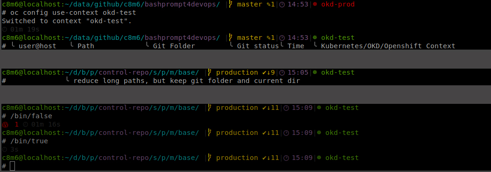

# bash_prompt

This little bash script make your bash much more pretty
and show you some information about Kubernetes, Git and
much more.

Additionaly it merged the history from all terminals.



# Install

Download and source the script:
```
echo 'source ~/.bash/bashprompt4devops.sh' >> ~/.bashrc
```

# Ugly fancy emojis?
```
sudo apt remove fonts-noto-color-emoji
```
