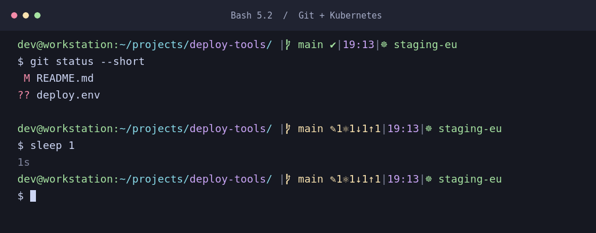
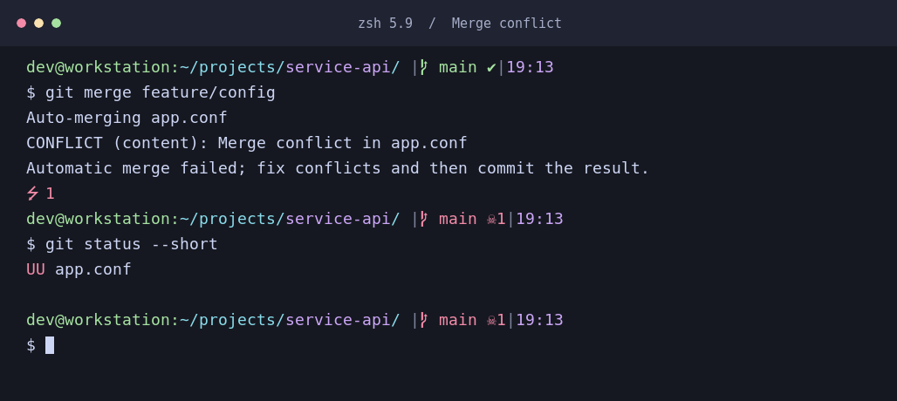

# bashprompt4devops

A three-line prompt for **Bash and zsh** with Git status, command runtime,
exit status and an optional Kubernetes context.

The prompt adapts long paths and branch names to the terminal width, highlights
SSH sessions, and shares Bash history between terminals.

[Installation](#installation) · [Configuration](#configuration) ·
[Prompt legend](#prompt-legend) · [Behavior](#behavior) ·
[Troubleshooting](#troubleshooting)

## Preview

**Bash: changed files, ahead/behind, command runtime and Kubernetes context**



**zsh: failed merge and conflict status**



These are new captures of the current script in isolated demo repositories.
See [capture details](docs/media/README.md) for the scenarios and rendering setup.

## Installation

### Requirements

- An interactive Bash or zsh session. Tested with Bash **3.2.57**, Bash **5.2.26**
  and zsh **5.9** on macOS.
- Git for the Git segment; `oc` or `kubectl` for the optional Kubernetes segment.
- Standard Unix utilities. Neither `bc` nor GNU `date`/`gdate` is required.
- A UTF-8 terminal. A [Nerd Font](https://www.nerdfonts.com/font-downloads)
  is recommended for the branch glyph and other symbols.

### Install and try

```sh
git clone https://github.com/c8m6/bashprompt4devops.git "$HOME/.local/share/bashprompt4devops"
source "$HOME/.local/share/bashprompt4devops/bashprompt4devops.sh"
```

`source` runs the script in your current shell. Executing it as a separate
process does not configure the prompt.

### Load on startup

Add this line **once**, near the end of `~/.bashrc` for Bash or `~/.zshrc` for zsh,
after other prompt configuration:

```sh
source "$HOME/.local/share/bashprompt4devops/bashprompt4devops.sh"
```

For Bash login shells, make sure `~/.bash_profile` loads `~/.bashrc` if your
existing configuration does not already do so:

```sh
if [ -f "$HOME/.bashrc" ]; then
  source "$HOME/.bashrc"
fi
```

Open a new terminal to verify the startup configuration. Startup file behavior
is described in the [Bash manual](https://www.gnu.org/software/bash/manual/html_node/Bash-Startup-Files.html)
and [zsh manual](https://zsh.sourceforge.io/Doc/Release/Files.html).

## Configuration

All settings use the same convention: **`true` disables the feature**.
Unset variables and `false` keep it enabled. Values are case-sensitive.

| Variable | Default | Effect when set to `true` |
| --- | --- | --- |
| `BP_DISABLE_CLOCK` | `false` | Hide the clock. |
| `BP_DISABLE_EXITSTATUS` | `false` | Hide both the exit status and command runtime. |
| `BP_DISABLE_GITFETCH` | `false` | Stop automatic background fetches; keep the local Git status visible. |

For example, add these settings before the `source` line in your shell's startup
file:

```sh
export BP_DISABLE_CLOCK=true
export BP_DISABLE_EXITSTATUS=false
export BP_DISABLE_GITFETCH=true
source "$HOME/.local/share/bashprompt4devops/bashprompt4devops.sh"
```

You can also change a setting in an open terminal. It takes effect at the next
prompt; there is no need to source the script again.

## Prompt legend

The first line shows a failed command's exit status and any nonzero runtime.
The second line contains `user@host`, the current path and the available status
segments. The third line is reserved for typing commands.

| Display | Meaning |
| --- | --- |
| `! 1` | The previous command failed with exit status `1`. |
| `2s`, `3m 05s`, `25h 01m 01s` | Command runtime in whole seconds. Time spent waiting at the prompt is excluded. |
| `user@host` | Current user and host; a red user indicates root, a yellow host indicates an SSH session. |
| `~/p/project/` | Current path, with intermediate directories abbreviated when it is long. The repository directory is highlighted. |
| Branch icon followed by `main` | Current Git branch. Long names are shortened; a detached HEAD appears as `(detached)`. |
| `✔` | The local working tree is clean. It can still be ahead of or behind its upstream. |
| `✎2` | Two changed tracked entries, including staged and unstaged changes. |
| `⚛1` | One untracked entry. Git may group an untracked directory into one entry. |
| `☠1` | One unresolved merge conflict. |
| `↑2` / `↓1` | Two commits ahead of / one commit behind the upstream's last fetched state. |
| `HH:MM` | Local time in 24-hour format. |
| `☸ staging-eu` | Current Kubernetes context. |
| `$` / `#` | Command entry marker for a regular user / root. |

The Git segment is **green** when clean and synchronized, **yellow** for local
changes or ahead/behind differences, and **red** for unresolved conflicts.
Ahead/behind counts require a configured upstream branch.

## Behavior

### Git and automatic fetches

Automatic fetching is **enabled by default**. Displaying a prompt inside a Git
repository can start `git fetch --quiet` against its configured default remote.
The fetch runs in the background and is throttled to at most one attempt every
five minutes. This is triggered by prompt activity, not a timer running while
the terminal is idle.

Worktrees share a fetch lock and throttle. Failed attempts are also throttled,
and fetch output is suppressed. Existing Git authentication still applies;
interactive Git credential prompting is disabled for these fetches.

The visible counters use locally stored remote-tracking refs. A completed fetch
is reflected when the next prompt is displayed. Fetching does not merge or
modify your working-tree files.

To control when remote information is refreshed:

```sh
export BP_DISABLE_GITFETCH=true
git fetch
```

### Kubernetes

The script automatically prefers `oc` when available and falls back to `kubectl`.
The context comes from `config current-context`, respecting `KUBECONFIG`
and merged kubeconfig files. This reads local configuration; it does not query
the Kubernetes API server. The segment is omitted if both commands are unavailable
or there is no configuration or current context.

### History and shell integration

Bash writes new history entries and reloads the shared history file before each
prompt. Sessions using the same `HISTFILE` can see each other's commands.
`HISTSIZE` continues to limit the in-memory history. Synchronization is skipped
when `HISTFILE` is unset, empty or `/dev/null`.

zsh keeps its existing history configuration. This script does not enable zsh
history sharing.

Existing Bash `PROMPT_COMMAND` hooks and DEBUG traps are retained. zsh uses
`precmd_functions` and `preexec_functions`. Bash with bash-preexec (including
iTerm2 shell integration) uses its existing hook arrays. The script sets `PS1`
before each prompt, configures prompt expansion and only initializes once per
shell. Noninteractive sessions are ignored. Conda's environment prefix (such as
`(base)`) is hidden; environment activation continues to work normally.

## Troubleshooting

- **Missing symbols or square boxes:** select a Nerd Font in your terminal's
  font settings. For uncommon Unicode symbols, a font such as
  [Noto Sans Symbols 2](https://github.com/google/fonts/tree/main/ofl/notosanssymbols2)
  may be needed as a fallback. Emoji appearance also depends on the terminal and fallback
  fonts; there is no need to remove system font packages.
- **The old prompt is still visible:** check the startup file for the shell you
  are actually using. Load this script after other prompt themes or frameworks.
- **Remote counters look stale:** they represent the last fetched state. Run
  `git fetch` to refresh it immediately, and check that the branch has an upstream.
- **No Kubernetes segment:** run `oc config current-context` (or
  `kubectl config current-context`) and check your `KUBECONFIG` or `~/.kube/config`.
- **Script changes do not appear after sourcing again:** open a fresh shell;
  repeated sourcing intentionally skips initialization. Configuration variables
  can still be changed in the current session.
- **No colors:** `TERM=dumb` intentionally disables the color sequences.

## Updating and removing

Update your installed checkout, then open a new terminal:

```sh
git -C "$HOME/.local/share/bashprompt4devops" pull --ff-only
```

To stop using the prompt, remove its `source` line and any `BP_DISABLE_*`
settings from your startup file, then open a new terminal.

## Development

Basic checks from the repository root:

```sh
bash -n bashprompt4devops.sh
zsh -n bashprompt4devops.sh
git diff --check
```

Syntax checks do not replace interactive testing. Verify command failures,
runtime, long paths and input lines, clean/dirty/conflicted repositories,
ahead/behind counters, worktrees and existing hooks in both shells.
